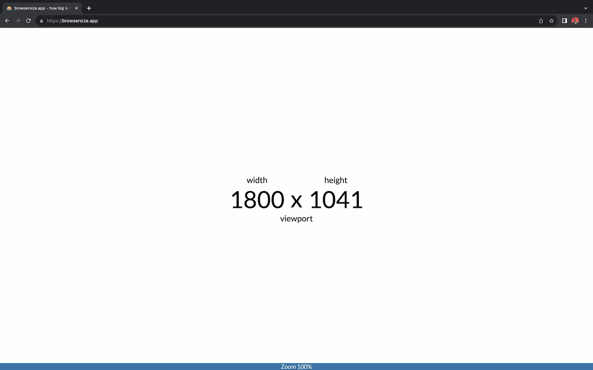

# browsersize.app

Authors: Felicitas Tomke, Oliver Jessner

Visits [browsersize.app](https://browsersize.app) and display the size of your browser window. It also tells you if your are zoomed in or out.



## Install

install bun like a big boy

```bash
curl -fsSL https://bun.sh/install | bash
```

run bun install

```bash
bun install
```

## Staging

```bash
bun run staging
```

visit localhost:3000 and have fun
